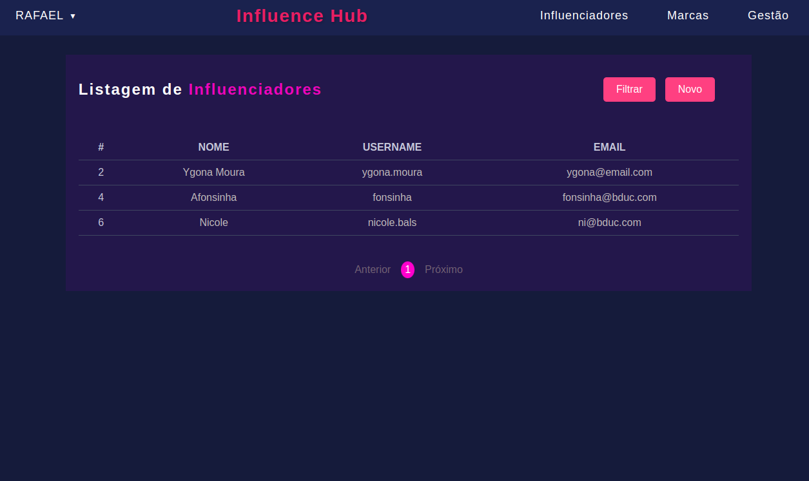
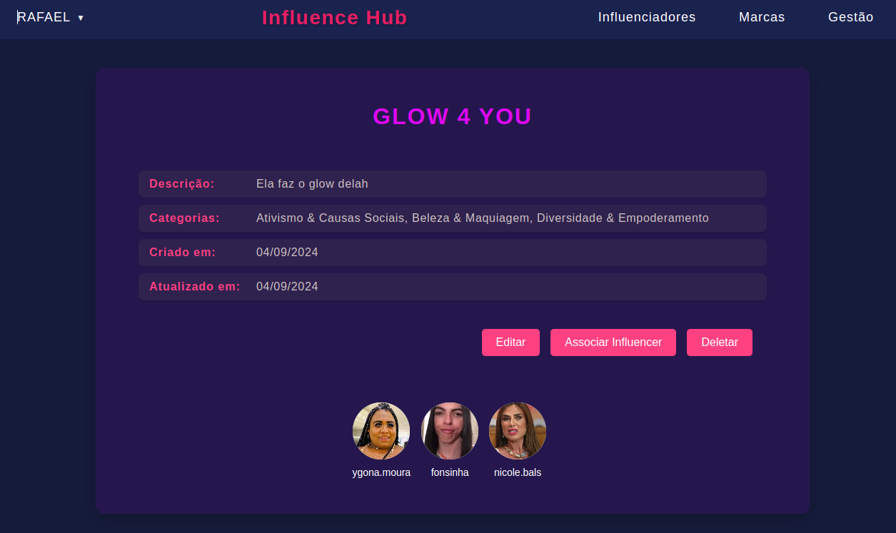

# 😎 Front-end da aplicação InfluenceHub

###

<br>

Este projeto é uma interface com o objetivo de simplificar a gestão de influenciadores e marcas. Com recursos que permitem criar, visualizar, atualizar e relacionar influenciadores e marcas de acordo com nichos, a plataforma visa aumentar a produtividade e a buscar o influenciador digital adequado para promover sua marca.

Além disso, a aplicação realiza integração com o [servidor back-end](https://github.com/rafittu/back-influence-hub) e AWS S3 Bucket para armazenamento seguro de dados.


<br>

## Tecnologias

Foram utilizadas as seguintes tecnologias no desenvolvimento:

- **React**: Biblioteca JavaScript para criar interfaces de usuário;
- **React Router Dom**: Biblioteca para roteamento na aplicação;
- **React Hooks**: Funções que permitem ligar os recursos de state e ciclo de vida do React;
- **Context API**: Gerenciamento de estado da aplicação;
- **Prop Types**: Verificação de tipos para props em componentes React;
- **AWS S3 Bucket**: Armazenamento de dados em nuvem;

<br>

## Funcionalidades
<br>

O usuário conta com os seguintes serviços:

- Cadastrar um administrador.
- Login de administrador.

<br>

- Cadastrar um novo influenciador.
- Visualizar lista de influenciadores.
- Filtrar influenciadores por:
    - **cidade**;
    - **categoria**;
    - **alcance minimo**;
    - **alcance máximo**;
- Editar um influenciador.

<br>

- Cadastrar uma marca.
- Visualizar lista de marcas.
- Associar influenciadores a marca.
- Visualisar influenciadores associados a marca.
- Editar informações da marca.

<br>

## Instalação

<br>

Clonando o repositório:

```bash
$ git clone git@github.com:rafittu/front-influence-hub.git
```

Instalando as dependências:

```bash
$ cd front-influence-hub
$ npm install
```

<br>

## Iniciando o app

<br>

Crie um arquivo `.env` na raiz do projeto e preencha as informações de acordo com o arquivo `.env.example` disponível.

Iniciando o servidor:

```bash
# modo de desenvolvimento
$ npm run start
```

<br>

## Uso

Com a interface front-end em execução, você deve iniciar o [servidor back-end](https://github.com/rafittu/back-influence-hub) e começar a explorar as funcionalidades!

<br>


<br>


<br>




<br>

##

<p align="right">
  <a href="https://www.linkedin.com/in/rafittu/">Rafael Ribeiro 🚀</a>
</p>

